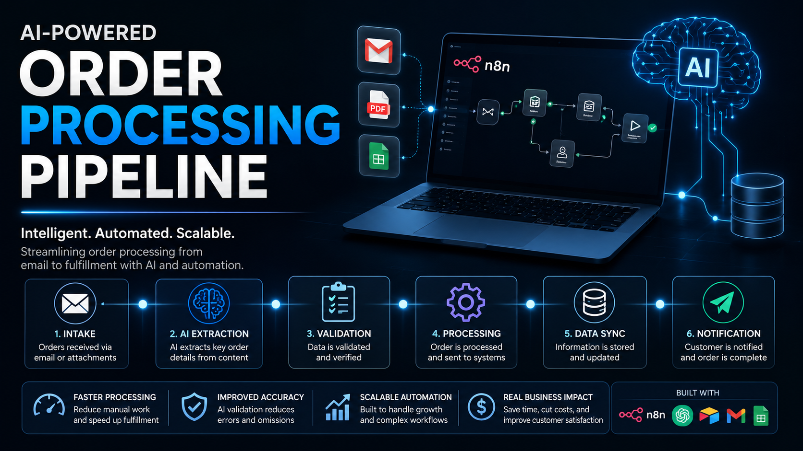
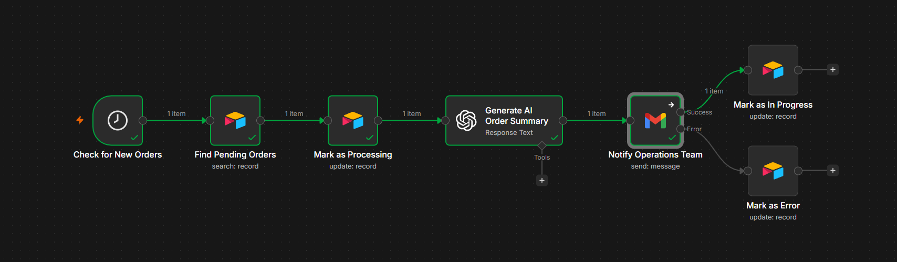
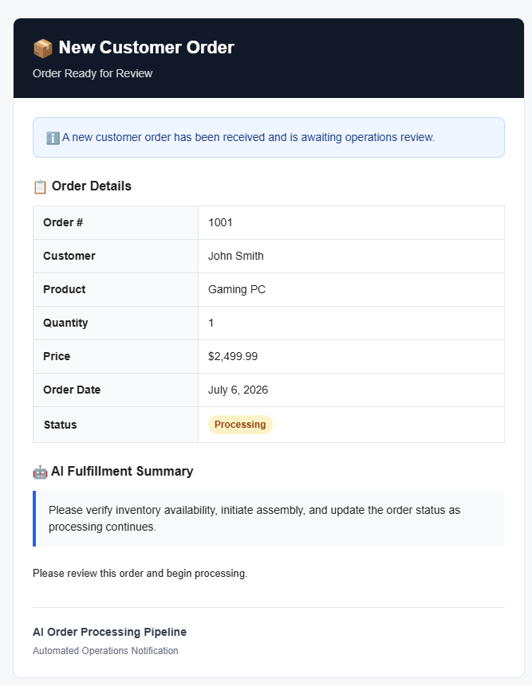

# 🤖 AI Order Processing Pipeline

<p align="center">
  
</p>

An AI-powered **n8n workflow** that automates the processing of new customer orders by monitoring Airtable, generating professional order summaries with OpenAI, notifying the operations team through Gmail, and updating order statuses automatically.


## Overview

This workflow eliminates manual order notification by automatically:

- Monitoring Airtable for new customer orders
- Updating the order status to **Processing**
- Generating a professional internal order summary using OpenAI
- Sending an email notification to the Operations Team
- Updating the order status to **In Progress** once the Operations Team has been successfully notified
- Updating the order status to **Error** if the notification fails

The workflow is designed to demonstrate practical AI automation for internal business operations.


## Business Value

This workflow demonstrates how AI can streamline internal order processing by:

- Reducing repetitive manual order processing tasks
- Automatically notifying operations teams of new orders
- Generating concise AI-assisted order summaries
- Tracking order status throughout the fulfillment process
- Improving consistency and reducing human error
- Separating AI-generated recommendations from operational data


## Workflow Overview




## Workflow

```text
Schedule Trigger
        │
        ▼
Find Pending Orders
        │
        ▼
Mark as Processing
        │
        ▼
Generate AI Order Summary
        │
        ▼
Notify Operations Team
     ┌──┴───────────────┐
     ▼                  ▼
Success              Failure
     │                  │
     ▼                  ▼
Mark In Progress    Mark as Error
```


## Sample Notification

Below is an example of the HTML email automatically generated and sent to the Operations Team.



## Features

- ⏰ Automatically monitors Airtable for new orders
- 📋 Tracks order status throughout processing
- 🤖 Generates AI-powered operational summaries
- 📧 Sends automated Gmail notifications
- ✅ Updates order status automatically
- ⚠️ Handles notification failures gracefully


## Technologies Used

| Technology | Purpose |
|------------|---------|
| n8n | Workflow orchestration |
| OpenAI GPT-4o Mini | AI-generated operational summaries |
| Airtable | Order management database |
| Gmail API | Operations team notifications |


## Setup


### Prerequisites

- n8n
- Airtable account
- OpenAI API key
- Gmail account with OAuth configured


### Installation

1. Import the workflow into n8n.
2. Configure your Airtable, OpenAI, and Gmail credentials in n8n.
3. Connect the workflow to your Airtable Base and Table.
4. Replace the placeholder Operations Team email address.
5. Activate the workflow.
6. Create a sample order in Airtable to verify the automation.

## Repository Structure

```
.
├── images/
├── workflows/
│   └── ai-order-processing-pipeline.json
├── .gitignore
├── LICENSE
├── README.md
├── notes.md
└── todo.md
```


## Future Improvements

### Notifications

- Customer-facing HTML email templates
- Slack integration
- Microsoft Teams integration

### Workflow

- Batch order processing
- Retry failed email deliveries
- Order prioritization

### Integrations

- Shopify
- Oracle ERP
- SAP
- Microsoft Dynamics

### Reporting

- PDF invoice generation
- Analytics dashboard


## License

This project is licensed under the MIT License.